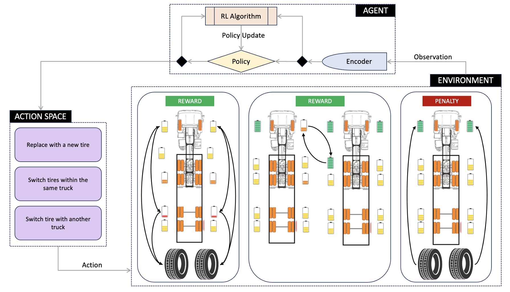
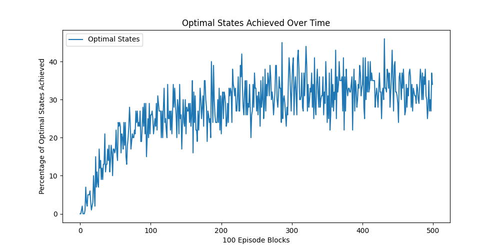
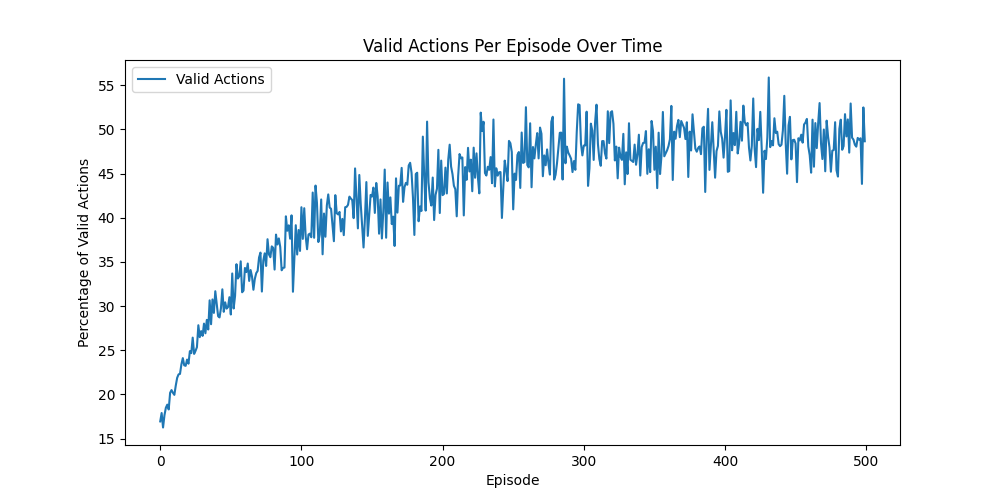

# Truck Fleet Maintenance Optimization

This project aims to optimize the maintenance strategy for a fleet of trucks using Reinforcement Learning (RL).

## Problem Statement

### Business Problem

Without an effective tire management strategy, commercial truck fleets face several issues:
- **Increased tire waste**
- **Higher operational costs**
- **Reduced vehicle performance and safety**
- **Larger environmental footprint**

### Objectives

Michelin Tires aims to address these issues by optimizing tire maintenance strategies to achieve an optimal state where:
- All tires have an RCP greater than 0.09 (9%)
- Steer tires have a higher priority, maintaining a greater RCP than rear and drive tires

### Solution

To develop a proof of concept demonstrating the use of Reinforcement Learning (RL) for optimizing tire rotation strategies, the project includes:
- Creating a custom OpenAI Gym environment to simulate truck fleet dynamics, tire wear, and RCP predictions.
- Implementing an RL policy using Deep Q-Networks (DQN) to handle complex action spaces and real-time decision-making.
- Evaluating the performance of the RL agent in achieving optimal states across the fleet.



## Project Structure

### Python Scripts

- **`env.py`**: Defines the custom gym environment for the truck maintenance simulation.
- **`dqn.py`**: Contains the implementation of the Deep Q-Network (DQN) algorithm.
- **`train.py`**: Script to train the DQN agent.
- **`main.py`**: Main script to run the simulation and evaluate the trained model.
- **`utils.py`**: Utility functions for data processing and model evaluation.
- **`app.py`**: Docker application file to set up a basic simulation.
- **`predict.py`**: Script for making predictions using the trained model.
- **`rule_based.py`**: Rule-based logic for tire management.
- **`schemas.py`**: Defines data schemas for the simulation.
- **`test_predict.py`**: Unit tests for the prediction script.

### Additional Files

- **`dqn_truck_fleet.pth`**: Trained DQN model weights.
- **`episode_timestep_reward.csv`**: CSV file containing episode, timestep, and reward data from training.
- **`optimal_states_plot.png`**: Plot showing the percentage of optimal states achieved over time.
- **`valid_actions_plot.png`**: Plot showing the percentage of valid actions taken per episode over time.

## Installation

To run this project, you need Python 3.x installed along with the required packages. Install the necessary packages using:

```bash
pip install -r requirements.txt
```


## Docker Setup

To set up the simulation environment using Docker, follow these steps:

1. Build the Docker image:

    ```bash
    docker build -t truck-fleet-simulation .
    ```

2. Run the Docker container:

    ```bash
    docker run -it truck-fleet-simulation
    ```

### Docker Files

Ensure the following Docker-related files are included in your project:

- **`Dockerfile`**: Defines the Docker image configuration.
- **`docker-compose.yml`**: (Optional) Defines services, networks, and volumes for Docker Compose.


## Usage

### Training the DQN Agent

To train the DQN agent, run the `train.py` script:

```bash
python train.py
```

### Running the Simulation

To run the simulation and evaluate the trained model, use the `main.py` script:

```bash
python main.py
```

### Making Predictions

To make predictions using the trained model, use the `predict.py` script:

```bash
python predict.py
```


### Testing Predictions

To run unit tests for the prediction script, use the `test_predict.py` script:

```bash
python test_predict.py
```

### Visualizing Results

The results can be visualized using the provided plots:

#### Optimal States Achieved Over Time

This plot illustrates the percentage of optimal states achieved in blocks of 100 episodes over the training period. An optimal state is defined as a state where the maintenance actions result in the highest possible RCP for the truck tires.



#### Valid Actions Per Episode Over Time

This plot shows the percentage of valid actions taken per episode throughout the training process. A valid action is any action that adheres to the defined rules and constraints of the environment.



## Summary / Next Steps

### Achievements

- Developed a proof of concept showing the effectiveness of Reinforcement Learning in optimizing tire rotation strategies.
- Demonstrated the agent's ability to achieve optimal states across a simulated fleet of trucks.

### Future Work

- Integrate the solution with IDEAL Lab’s RCP Predictor, based on a Probabilistic Temporal-Fusion-Transformer Digital Twin.
- With higher computational resources, train a model capable of dynamically handling multiple trucks with versatile tire configurations.
- Deploy the solution to Michelin Tire locations for real-world application and impact.


## Contributors

- Shubhi Gupta [LinkedIn](https://www.linkedin.com/in/shubhigupta99/)
- Pavan Kumar Dharmoju [LinkedIn](https://www.linkedin.com/in/pavandharmoju/)

